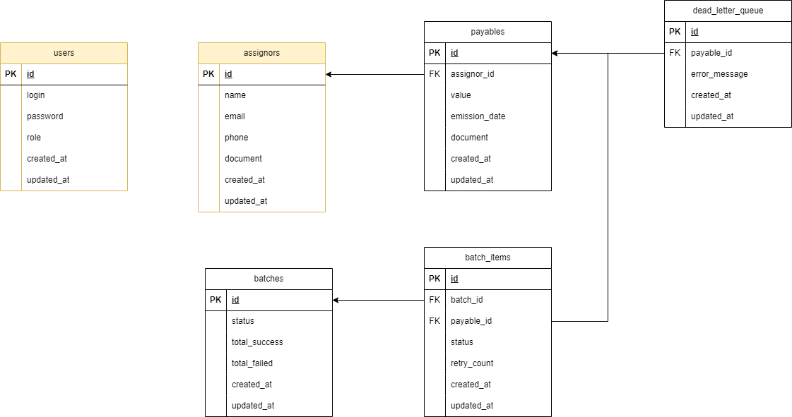

# BankMe Receivables Management System

## 🌐 Links do Projeto

- **Aplicação Front-end**: [Acesse a aplicação aqui](https://pedrobankme.ip-ddns.com)

  - **Credenciais de acesso**:

  ```
    - Usuário: aprovame
    - Senha: aprovame
  ```

- **Documentação da API**: [Swagger](https://api.pedrobankme.ip-ddns.com/api/docs)

  - Explore todos os endpoints da API de forma interativa.

- **Painel RabbitMQ**: [Acesse o RabbitMQ Dashboard](https://rabbitmq.pedrobankme.ip-ddns.com)
  - **Credenciais**:
  ```
    - Usuário: aprovame
    - Senha: aprovame
  ```

### 📘 Leia Mais

Para informações detalhadas sobre a configuração, execução e detalhes técnicos do projeto, consulte os arquivos **README** presentes nas pastas `front-end` e `back-end`.

---

## 📝 Sobre o Projeto


O **BankMe Receivables Management System** é uma solução para gerenciamento eficiente de recebíveis e cedentes.

### 🚀 Funcionalidades do Sistema

- **Gestão de Recebíveis e Cedentes**:

  - Cadastro, edição, consulta e exclusão de recebíveis e cedentes.
  - Operações protegidas por autenticação JWT, garantindo que apenas usuários autorizados possam interagir com os dados.
  - Diferentes perfis de usuários com permissões específicas, como Admin, Operador, Auditor, etc.

- **Processamento em Lote**:

  - Envio de até **10.000 recebíveis** de uma única vez para processamento em segundo plano.
  - Uso do **RabbitMQ** para garantir que o processamento em lote seja feito de forma assíncrona, sem sobrecarregar o sistema e mantendo a fluidez das operações.

- **Gerenciamento de Filas Mortas e Resiliência**:

  - Reenvio automático de itens que falharem durante o processamento em lote até quatro tentativas.
  - Itens não processados após essas tentativas são movidos para uma **"Fila Morta"** e notificações automáticas são enviadas ao time de operações, garantindo monitoramento e rastreabilidade de falhas.

- **Autenticação e Perfis de Usuário**:
  - Controle de acesso com JWT, garantindo que cada usuário tenha acesso apenas ao que precisa.
  - Perfis de usuário predefinidos, como:
    - **Admin**: Acesso total ao sistema.
    - **Operator**: Pode processar recebíveis e gerenciar cedentes.
    - **Auditor**: Permissão somente de leitura.
    - **Manager**: Gerencia transações, cedentes e recebíveis.
    - **Support**: Acesso limitado para suporte ao cliente.

### 🏗️ Estrutura do Projeto

O projeto está dividido em duas partes principais para facilitar a manutenção e escalabilidade:

- **Back-end**: Desenvolvido em **NestJS** com **Prisma** como ORM e **RabbitMQ** para processamento assíncrono de lotes. O banco de dados utilizado é **SQLite** no ambiente de desenvolvimento e toda a infraestrutura é gerida por **Docker**.
- **Front-end**: Construído em **React** para criar uma interface amigável e responsiva. Foi utilizado o **Tailwind CSS** e o **Daisy UI** para estilização e **Vite** para acelerar o desenvolvimento.

### 📂 Organização das Pastas

- **project/back-end**: Contém a lógica do servidor, módulos da API, testes unitários e a configuração para rodar o projeto com Docker.
- **project/front-end**: Código do front-end, com todos os componentes da interface, páginas e comunicação com a API.

### ⚙️ Tecnologias Utilizadas

- **NestJS**: Para um back-end escalável e bem estruturado.
- **Prisma ORM**: Gerenciamento do banco de dados, facilitando operações e migrações.
- **JWT**: Para autenticação segura e controle de acesso.
- **Docker**: Garantindo consistência entre ambientes de desenvolvimento e produção.
- **RabbitMQ**: Para processamento assíncrono e gerenciamento de filas em operações em lote.
- **React**: Framework para construção de uma interface moderna e reativa.
- **Tailwind CSS**: Para uma estilização responsiva e consistente.
- **Vite**: Para acelerar o desenvolvimento do front-end.
- **TypeScript (TS)**: Utilizado tanto no front-end quanto no back-end para trazer tipagem estática, aumentando a segurança e reduzindo erros durante o desenvolvimento.

---

### 🧪 Testes

Todos os testes unitários foram implementados.

### 🗃️ Modelo de Banco de Dados



---

Consulte os **READMEs** específicos do front-end e do back-end para informações detalhadas de configuração e execução.
